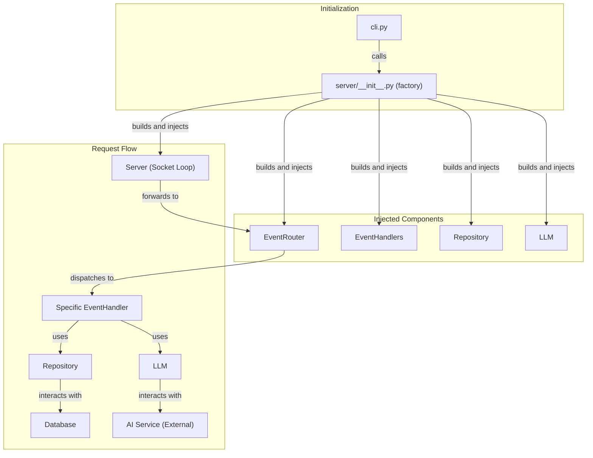
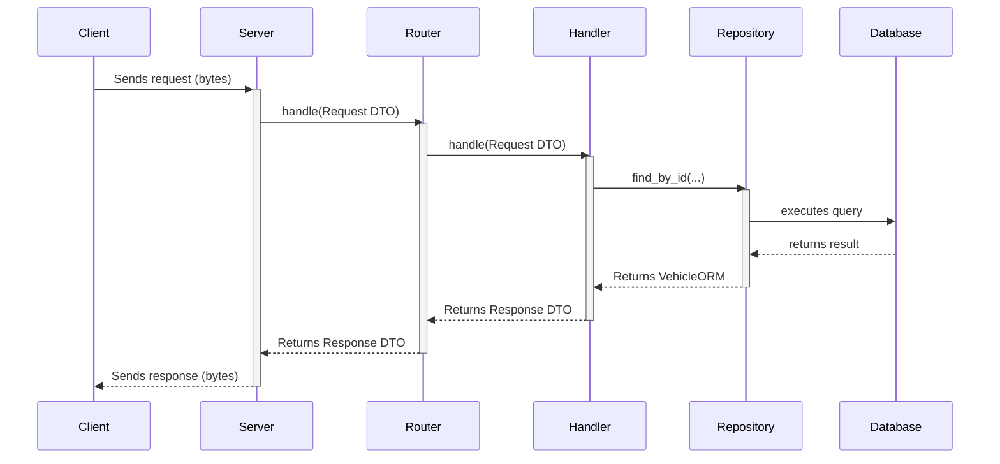
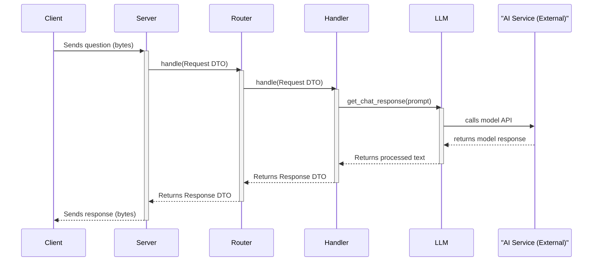
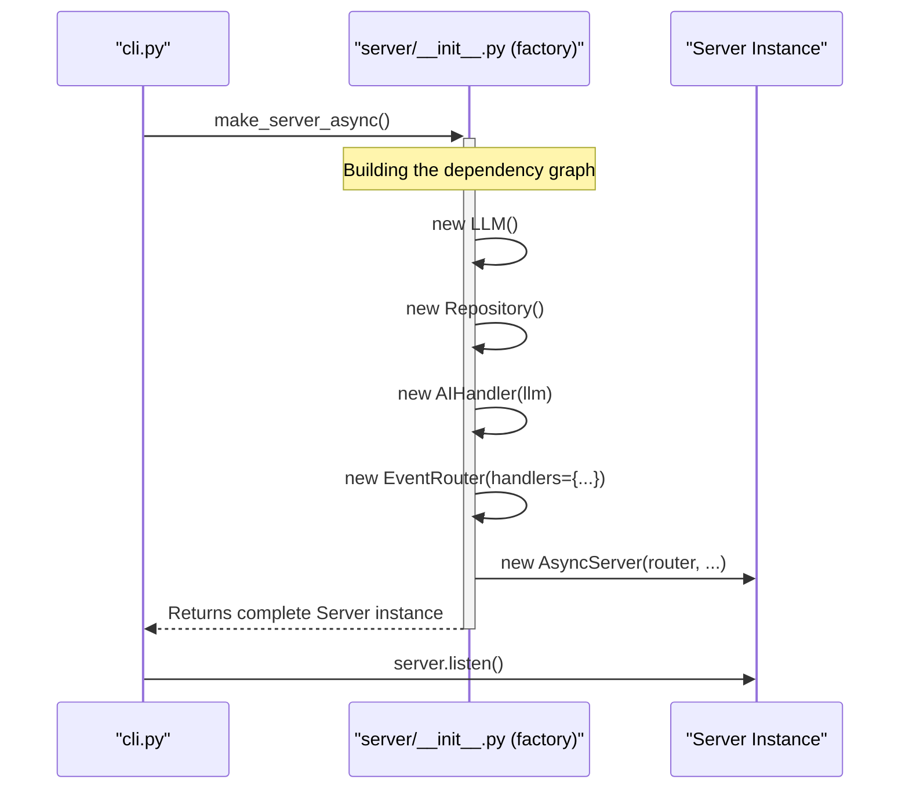

# Project Architecture

## 1. Overview

This document describes the software architecture for the project, an asynchronous client-server application. The goal is to establish a robust and modular network communication system, where the server processes requests, interacts with a database, and communicates with Generative Artificial Intelligence services.

The architecture is heavily based on **Manual Dependency Injection** and **Separation of Concerns (SoC)**, with a directory structure that isolates layers such as `client`, `server`, `database`, and `common`.

## 2. Technology Stack

- **Language:** Python 3.11+
- **Asynchronous Programming:** `asyncio`
- **Database ORM:** `SQLAlchemy`
- **Communication:** `asyncio.streams` TCP/IP Sockets
- **Dependency Injection:** Custom framework with Factory Functions (Composition Root Pattern)
- **Artificial Intelligence:** Integration with Generative Models (e.g., Google Gemini)
- **Command-Line Interface:** `cli.py` (`Typer`)

## 3. Directory Structure

The project structure is modular and domain-oriented, facilitating maintenance and testability.

```
c2s_challenge/
├── client/
│   └── __init__.py         # Contains the `make_client_async` factory
├── common/
│   ├── protocol/
│   └── setting/
└── server/
    ├── __init__.py         # Contains the `make_server_async` factory
    ├── aicore/             # Business logic and AI integration (LLM)
    ├── database/           # Data access layer (ORM, Repository)
    ├── event/              # Event routing (Router, Handlers)
    └── server.py
```

## 4. Architectural Patterns and Key Concepts

#### 4.1. Manual Dependency Injection (Composition Root Pattern)

The architecture employs Dependency Injection (DI) manually. This pattern is centralized in the `__init__.py` files of the `server` and `client` modules.

- **Factory Functions (`make_server_async`):** These functions are responsible for instantiating all classes and their dependencies, building the complete object graph, and manually "injecting" the instances into the constructors.
- **Entry Point (`cli.py`):** The CLI is the sole component responsible for calling these factory functions to assemble the application and start its lifecycle.

#### 4.2. Router-Handler Pattern (Event Dispatcher)

The server's core operates on a dispatcher pattern to process requests.

- **`Server` (`server.py`):** Manages the connection and delegates processing.
- **`EventRouter` (`event/router.py`):** Acts as a central dispatcher that inspects the request's event type and invokes the appropriate `Handler`.
- **`EventHandler` (`event/handler.py`):** Small, focused classes, each responsible for the logic of a single event type.

#### 4.3. `LLM` - Artificial Intelligence Layer

The `LLM` component (`server/aicore`) encapsulates all logic for interacting with the generative language model. It abstracts the complexity of formatting prompts, calling the external API, and processing responses, providing simple methods for the `Handlers` to use.

## 5. Execution Flow

#### 5.1. Server Component Diagram



#### 5.2. CRUD Request Flow (Sequence Diagram)



#### 5.3. AI-Powered Request Flow (Sequence Diagram)



#### 5.4. Server Initialization (Sequence Diagram)


