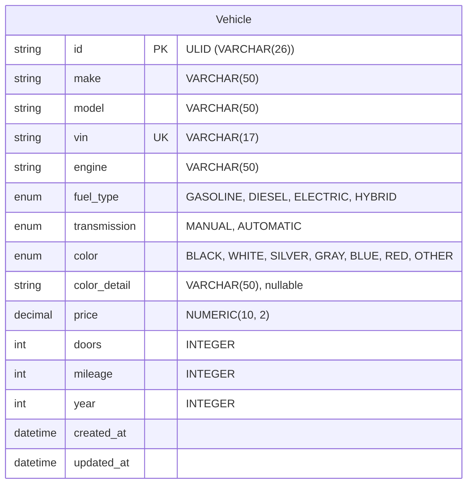

# Database

## 1. Structure Diagram

```mermaid
erDiagram
    Vehicle {
        string id PK "ULID (VARCHAR(26))"
        string make "VARCHAR(50)"
        string model "VARCHAR(50)"
        string vin UK "VARCHAR(17)"
        string engine "VARCHAR(50)"

        enum fuel_type "GASOLINE, DIESEL, ELECTRIC, HYBRID"
        enum transmission "MANUAL, AUTOMATIC"
        enum color "BLACK, WHITE, SILVER, GRAY, BLUE, RED, OTHER"
        
        string color_detail "VARCHAR(50), nullable"
        
        decimal price "NUMERIC(10, 2)"
        
        int doors "INTEGER"
        int mileage "INTEGER"
        int year "INTEGER"
        
        datetime created_at
        datetime updated_at
    }
```